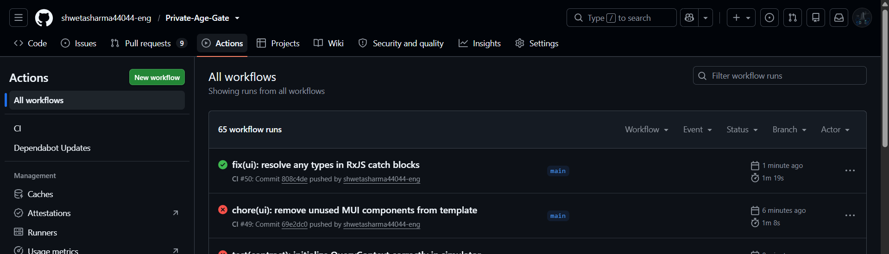
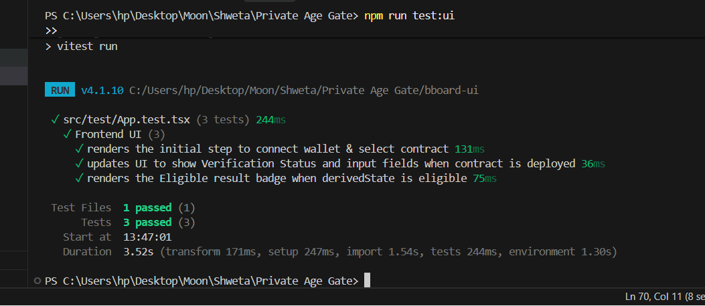

# 🛡️ Private Age Gate

[](https://github.com/shwetasharma44044-eng/Private-Age-Gate/actions/workflows/ci.yml)

A production-grade decentralized application (Level 3) built on the Midnight Network. The Private Age Gate allows users to cryptographically prove they meet a specific age threshold (e.g., ≥ 18) without ever revealing their actual age, date of birth, or identity.

## 🌟 Hackathon Submission

Please refer to the [PROPOSAL.md](./PROPOSAL.md) for the detailed problem statement, solution overview, and why Midnight Network's unique features make this possible.

## 🏛️ Architecture & Privacy Model

The application leverages Midnight's Compact smart contracts to generate Zero-Knowledge proofs locally.

| Data | Storage | Visibility |
|------|---------|------------|
| **User's Actual Age** | Local Wallet (Witness) | 🔒 **Private** (Never leaves the device) |
| **Eligibility Result** (`true/false`) | Midnight Public Ledger | 🌍 **Public** (Verifiable on-chain) |
| **Verification Timestamp** | Midnight Public Ledger | 🌍 **Public** |
| **Wallet Public Key** | Midnight Public Ledger | 🌍 **Public** |

### Circuit Logic (`verifyEligibility`)
1. Ingests the `localAge` from the user's secure wallet enclave (witness).
2. Asserts `localAge >= threshold` within the ZK circuit.
3. Outputs `true` to the ledger if the proof succeeds. If the proof fails, the transaction aborts and nothing is recorded.

## 🚀 Setup and Local Run

### Prerequisites
- Node.js 24+
- Docker (required for `compact` compiler toolchain)
- Lace Wallet browser extension

### Installation
1. Clone the repository:
   ```bash
   git clone https://github.com/shwetasharma44044-eng/Private-Age-Gate.git
   cd Private-Age-Gate
   ```
2. Install dependencies:
   ```bash
   npm install
   ```
3. Compile the contract and build the frontend:
   ```bash
   npm run build:start
   ```
4. Open the UI at `http://localhost:xxxx` (port will be printed in the terminal).

## 🧪 Testing

The project includes strict verification tests ensuring zero privacy leaks.

```bash
# Run contract circuit tests
npm run test:contract

# Run frontend UI tests
npm run test:ui
```

## 📸 Screenshots & Proof of Work

### 1. User Interface (UI)
*Add a screenshot of your beautiful Tailwind CSS frontend here.*


### 2. CI/CD Pipeline Success
*Add a screenshot of your passing GitHub Actions workflow here.*


### 3. Test Outputs
*Add a screenshot of your terminal showing passing unit tests for both contract and UI here.*


## 🌐 Deployed Network
- **Midnight Preprod Testnet**
- Contract Address: `TBD (will be populated upon final deployment)`
